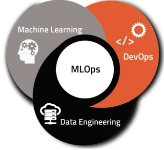

# Proyecto: Machine Learning Operations (MLOps)

  

## Descripción del Proyecto

Este proyecto se centra en el ciclo de vida completo de un sistema de recomendación de películas, desde el procesamiento de datos hasta el despliegue de un modelo de Machine Learning en producción. Se desempeñará en el rol de un MLOps Engineer, encargado de transformar datos, desarrollar una API para consulta de datos, y entrenar un modelo de recomendación.

## Contexto

Has desarrollado un modelo de recomendación con buenas métricas, y ahora necesitas llevarlo al mundo real. El ciclo de vida de un proyecto de Machine Learning abarca desde la recolección y tratamiento de datos hasta el entrenamiento y mantenimiento del modelo a medida que llegan nuevos datos.

## Requerimientos de Trabajo

### Transformaciones de Datos

Para el MVP, se realizaron las siguientes transformaciones en los datos:

- Desanidar campos como `belongs_to_collection`, `production_companies`, etc.
- Rellenar los valores nulos de `revenue` y `budget` con `0`.
- Eliminar las filas con valores nulos en `release_date`.
- Asegurar que las fechas estén en formato `AAAA-mm-dd` y crear una columna `release_year`.
- Crear una columna `return` calculando `revenue / budget` y asignar `0` cuando no hay datos disponibles.
- Eliminar las columnas `video`, `imdb_id`, `adult`, `original_title`, `poster_path`, y `homepage`.
- Filtar data para reducir el tamaño del archivo `data_final_ML.csv` (5000 registros, con el que se trabajaron los endpoints de la API).

### Análisis Exploratorio de los Datos (EDA)

Después de limpiar los datos, se realiza un análisis exploratorio para investigar relaciones entre variables, detectar outliers, y descubrir patrones interesantes. Además, incluye una nube de palabras para identificar términos frecuentes en los títulos.

### Desarrollo de la API

Se utilizó FastAPI para desarrollar una API con los siguientes endpoints:

1. **`/cantidad_filmaciones_mes/{mes}`**: Devuelve la cantidad de películas estrenadas en un mes específico.
2. **`/cantidad_filmaciones_dia/{dia}`**: Devuelve la cantidad de películas estrenadas en un día específico.
3. **`/score_titulo/{titulo}`**: Devuelve el título, año de estreno y score de una película.
4. **`/votos_titulo/{titulo}`**: Devuelve el título, cantidad de votos y valor promedio de votaciones para una película con al menos 2000 valoraciones.
5. **`/get_actor/{nombre_actor}`**: Devuelve el éxito de un actor, la cantidad de películas en las que ha participado y el promedio de retorno.
6. **`/get_director/{nombre_director}`**: Devuelve el éxito de un director, las películas que ha dirigido y detalles de cada una.

### Sistema de Recomendación

Se entrena un modelo de recomendación que sugiera películas similares basándose en la similitud de puntuación. Implementando esta función adicional en la API:

7. **`/recomendacion/{titulo}`**: Devuelve una lista de 5 películas similares a la proporcionada.

### Despliegue

El despliegue se realizó utilizando Render para que la API sea accesible desde la web (.../docs).

- **Render**: <https://proyecto-mlops-kpxh.onrender.com>

### Video de Demostración

- Explicación de ETL, EDA y desarrollo de la API.
- Explicación breve del modelo de recomendación.
- Resultados de las consultas API.
- **Google Drive**: <https://drive.google.com/file/d/1zAcaboRgk0Tg3LfwCIce8tOfI9opeDi3/view?usp=drive_link>

## Fuente de Datos

- **Datasets**: `movies_dataset.csv` y `credits.csv`.
- **Diccionario de Datos**: Descripciones de las columnas disponibles en el dataset.
- **Data**: <https://drive.google.com/drive/folders/1_Mre-XI31f1whYUZaBF5-RnOGashkuH4?usp=drive_link>

## Autor

Este proyecto fue elaborado por: José Daniel Rivera Hernández. (<Daniel.rivera.30@outlook.com>)

---

¡Saludos! 🚀

# Proyecto_MLOps
